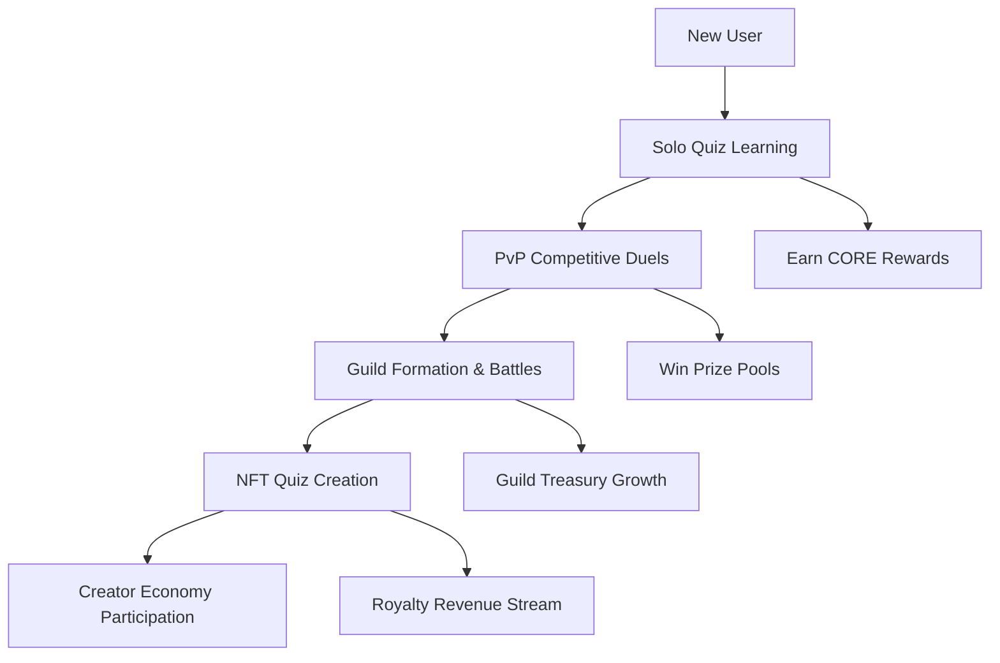
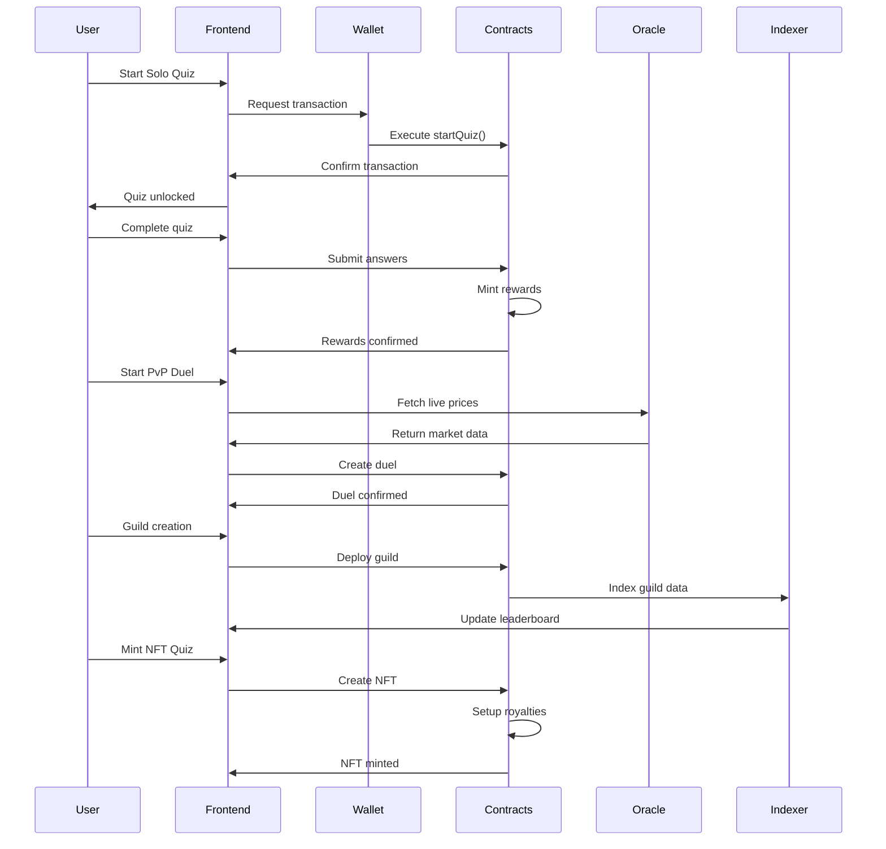

# 🏗️ Tezoro User Flow Architecture

## 📋 Overview

Tezoro is a decentralized quiz platform that evolves users through four key stages: **Solo Learning** → **Competitive PvP** → **Social Guilds** → **Creator Economy**. Each stage builds upon the previous, creating a comprehensive on-chain knowledge ecosystem.

## 🎯 High-Level User Journey



## 🔄 Detailed User Flow Architecture

### **Step 1: Solo Quiz Learning**
**Goal**: Onboard users and establish learning habits with immediate rewards

#### **User Actions**
1. **Connect Wallet** → MetaMask integration via RainbowKit
2. **Start Quiz** → On-chain transaction to `QuizGame.sol`
3. **Answer Questions** → Local state management with instant feedback
4. **Complete Quiz** → On-chain transaction to claim rewards

#### **Technical Flow**
```typescript
// Frontend Component: Step1SoloQuiz
┌─ User clicks "Start Quiz On-Chain"
├─ useWriteContract() calls QuizGame.startQuiz()
├─ MetaMask popup for transaction approval
├─ Transaction success → Quiz questions unlock
├─ User answers questions (local scoring)
├─ User clicks "Complete Quiz & Claim Rewards"
├─ useWriteContract() calls QuizGame.completeQuiz()
├─ MetaMask popup for reward claiming
└─ Success feedback → Ready for next step
```

#### **Smart Contract Integration**
```solidity
// QuizGame.sol
function startQuiz(string quizId, uint256 answer) external payable {
    // Entry fee validation
    // Initial token minting
    // Quiz session creation
}

function completeQuiz(uint256 finalAnswer) external {
    // Score validation
    // Bonus token minting
    // Session completion
}
```

#### **Blockchain Services**
- **Wagmi**: React hooks for contract interactions
- **Viem**: Ethereum library for transaction handling
- **Core DAO**: Fast finality for instant rewards

---

### **Step 2: PvP Competitive Duels**
**Goal**: Real-time competitive gameplay with oracle-powered dynamic content

#### **User Actions**
1. **Start PvP Duel** → Entry fee payment via MetaMask
2. **Matchmaking** → Simulated opponent matching
3. **Live Battle** → RedStone Oracle integration for dynamic questions
4. **Claim Rewards** → Winner takes prize pool

#### **Technical Flow**
```typescript
// Frontend Component: Step2PvPDuel
┌─ User clicks "Start PvP Duel"
├─ useWriteContract() calls QuizDuel.startDuel()
├─ MetaMask popup for entry fee (0.02 CORE)
├─ Transaction success → Matchmaking begins
├─ RedStone Oracle fetches live price data
├─ Dynamic question generation with current market data
├─ Battle simulation with commit-reveal scheme
├─ User clicks "Claim Duel Rewards"
├─ useWriteContract() calls QuizDuel.claimRewards()
└─ Prize pool distribution
```

#### **Smart Contract Integration**
```solidity
// QuizDuel.sol (placeholder - using QuizGame ABI for demo)
function startDuel(address opponent, uint256 stake) external payable {
    // Entry fee escrow
    // Duel session creation
    // Commit phase initialization
}

function submitAnswer(bytes32 hashedAnswer) external {
    // Commit-reveal implementation
    // Answer validation
}

function claimRewards() external {
    // Winner determination
    // Prize pool distribution
}
```

#### **Oracle Integration**
```typescript
// RedStoneOracle class
static async getPrice(symbol: string): Promise<{price: number, index: number}> {
    // Fetch real-time price from RedStone API
    // Return formatted price data for quiz questions
}

static formatPriceQuestion(symbol: string, price: number, options: string[]) {
    // Generate dynamic quiz question with current market data
    // Ensure one option matches current price
}
```

---

### **Step 3: Social Guild System**
**Goal**: Community building with shared treasuries and group competitions

#### **User Actions**
1. **Create Guild** → On-chain guild formation with initial treasury
2. **Contribute to Treasury** → Voluntary community funding
3. **Start Guild Battle** → Group vs group competitions
4. **View Results** → Real-time leaderboard updates

#### **Technical Flow**
```typescript
// Frontend Component: Step3GuildSystem
┌─ User clicks "Create Guild On-Chain"
├─ BlockchainUtils.triggerMetaMaskTransaction()
├─ Guild contract deployment with initial 0.05 CORE treasury
├─ User clicks "Contribute to Treasury"
├─ Additional MetaMask transaction for treasury funding
├─ User clicks "Start Guild Battle"
├─ Battle initiation with prize pool setup
├─ Goldsky indexer updates leaderboard in real-time
└─ Treasury growth and ranking updates
```

#### **Smart Contract Integration**
```solidity
// GuildSystem.sol
struct Guild {
    string name;
    address[] members;
    uint256 treasury;
    uint256 wins;
    uint256 totalEarnings;
}

function createGuild(string name) external payable {
    // Guild registration
    // Initial treasury setup
    // Member addition
}

function contributeToTreasury(uint256 guildId) external payable {
    // Treasury funding
    // Contribution tracking
}

function startGuildBattle(uint256 guild1, uint256 guild2) external payable {
    // Battle initialization
    // Prize pool escrow
    // Competition setup
}
```

#### **Indexing Integration**
```typescript
// GoldskyIndexer class
static async getGuildLeaderboard(): Promise<GuildRanking[]> {
    // Real-time blockchain data indexing
    // Guild performance metrics
    // Leaderboard generation
}

static async updateGuildStats(guildId: string, battleResult: BattleResult) {
    // Live statistics updates
    // Performance tracking
}
```

---

### **Step 4: NFT Creator Economy**
**Goal**: Monetize knowledge through NFT quizzes with royalty streams

#### **User Actions**
1. **Create Quiz Content** → Design questions and metadata
2. **Mint Quiz NFT** → On-chain NFT creation with royalty setup
3. **Earn Royalties** → Passive income from quiz plays
4. **Manage Content** → Update quizzes and pricing

#### **Technical Flow**
```typescript
// Frontend Component: Step4NFTQuizzes
┌─ User clicks "Create Quiz Content"
├─ Local quiz builder interface
├─ Question/answer validation
├─ User clicks "Mint Quiz NFT"
├─ BlockchainUtils.triggerMetaMaskTransaction()
├─ QuizNFT.mintQuiz() with ERC-721 + EIP-2981
├─ IPFS metadata upload
├─ NFT minting with royalty configuration
└─ Royalty stream activation
```

#### **Smart Contract Integration**
```solidity
// QuizNFT.sol
contract QuizNFT is ERC721, ERC721URIStorage, IERC2981 {
    struct Quiz {
        string title;
        address creator;
        uint256 playFee;
        uint256 royaltyPercent;
        uint256 playCount;
        uint256 totalEarnings;
        string ipfsHash;
    }

    function mintQuiz(
        string title,
        uint256 playFee,
        uint256 royaltyPercent,
        string ipfsHash
    ) external returns (uint256) {
        // NFT creation
        // Royalty setup
        // Creator registration
    }

    function playQuiz(uint256 tokenId, uint256 score) external payable {
        // Play fee collection
        // Royalty distribution
        // Performance tracking
    }
}
```

#### **Creator Economy Flow**
```typescript
// Royalty Distribution System
┌─ Player pays quiz fee
├─ Smart contract automatically splits payment:
│   ├─ Creator royalty (10%)
│   ├─ Platform fee (5%)
│   └─ Player rewards (85%)
├─ Instant settlement on Core
└─ Creator passive income stream
```

---

## 🔧 Technical Stack Architecture

### **Frontend Layer**
```typescript
// React + TypeScript + Vite
├─ @tanstack/react-router     // Navigation
├─ wagmi + viem              // Web3 interactions
├─ RainbowKit               // Wallet connection
├─ sonner                   // Toast notifications
├─ framer-motion           // Animations
└─ tailwindcss            // Styling
```

### **Blockchain Layer**
```solidity
// Smart Contracts (Solidity 0.8.30)
├─ Token1.sol              // ERC-20 reward token
├─ QuizGame.sol           // Solo quiz mechanics
├─ QuizDuel.sol          // PvP battle system
├─ GuildSystem.sol       // Guild management
└─ QuizNFT.sol          // NFT creator economy
```

### **Infrastructure Layer**
```yaml
# Blockchain Infrastructure
├─ Core Testnet2      # Fast, low-cost transactions
├─ MetaMask              # Wallet integration
├─ RedStone Oracle       # Real-time price feeds
├─ Goldsky              # Blockchain indexing
└─ IPFS                 # Decentralized storage
```

---

## 🌊 Data Flow Architecture

### **User Progression Data**


### **State Management**
```typescript
// Component State Architecture
┌─ DemoFlow (Root)
│   ├─ currentStep: 1|2|3|4
│   ├─ Manual navigation controls
│   └─ Step progression logic
│
├─ Step1SoloQuiz
│   ├─ quizStarted: boolean
│   ├─ quizCompleted: boolean
│   ├─ currentQuestion: number
│   ├─ score: number
│   └─ Contract interactions
│
├─ Step2PvPDuel
│   ├─ duelState: 'start'|'matchmaking'|'battle'|'result'
│   ├─ duelCompleted: boolean
│   ├─ oracleQuestion: OracleQuestion
│   └─ Battle simulation
│
├─ Step3GuildSystem
│   ├─ guildState: 'create'|'formed'|'battle'|'completed'
│   ├─ treasury: number
│   ├─ guildMembers: Member[]
│   └─ Guild interactions
│
└─ Step4NFTQuizzes
    ├─ nftState: 'create'|'mint'|'earning'|'completed'
    ├─ Quiz content creation
    └─ NFT minting flow
```

---

## 🔒 Security & Best Practices

### **Smart Contract Security**
- **Reentrancy Protection**: All payable functions use proper guards
- **Access Control**: Owner-only functions for admin operations
- **Input Validation**: Comprehensive parameter checking
- **Overflow Protection**: Solidity 0.8.30 built-in overflow protection

### **Frontend Security**
- **Type Safety**: Full TypeScript implementation
- **Transaction Validation**: Pre-flight checks before contract calls
- **Error Handling**: Graceful fallbacks for failed transactions
- **User Feedback**: Clear transaction status communication

### **Economic Security**
- **Fair Play**: Commit-reveal schemes for PvP battles
- **Treasury Management**: Multi-sig potential for guild funds
- **Royalty Enforcement**: EIP-2981 standard compliance
- **Fee Structure**: Sustainable tokenomics with platform fees

---

## 🚀 Scalability & Future Architecture

### **Network Optimization**
- **Core DAO Integration**: Sub-second finality for real-time gaming
- **Batch Operations**: Group multiple actions for gas efficiency
- **State Channels**: Potential for off-chain battle mechanics

### **Microservices Architecture**
```yaml
# Future Service Decomposition
├─ User Management Service    # Profile, progress tracking
├─ Quiz Content Service      # Question database, difficulty scaling
├─ Matchmaking Service       # Real-time PvP matching
├─ Guild Management Service  # Community features, governance
├─ Creator Economy Service   # Royalty management, analytics
└─ Analytics Service        # Performance metrics, leaderboards
```

### **Cross-Chain Expansion**
- **Multi-chain NFTs**: Deploy on multiple L2s
- **Bridge Integration**: Cross-chain guild competitions
- **Unified Identity**: Single profile across all chains

---

This architecture demonstrates a complete progression from individual learning to community building to creator monetization, all powered by real blockchain interactions and designed for scalability and user engagement.